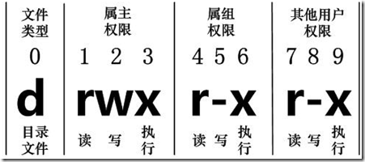

# linux文件基本属性
 - chown 修改所属用户与组
 - chmod 修改用户的权限
 - ll/ls-l 显示文件的属性和所属用户和组


```bash
[root@www /]# ls -l
total 64
dr-xr-xr-x   2 root root 4096 Dec 14  2012 bin
dr-xr-xr-x   4 root root 4096 Apr 19  2012 boot
```
- d 目录
- -文件
- l 链接文档
- b 装置文件里面的可供储存的接口设备(可随机存取装置)
- c 装置文件里面的串行端口设备，例如键盘、鼠标(一次性读取装置)
- r 可读
- w 可写
- x 执行

>这三个权限的位置不会改变，如果没有权限，就会出现减号 - 而已。



- 第 1-3 位确定属主（该文件的所有者）拥有该文件的权限
- 第4-6位确定属组（所有者的同组用户）拥有该文件的权限
- 第7-9位确定其他用户拥有该文件的权限
- *第 1、4、7 位读权限， r ，则有读权限， - 字符，则没有读权限*
- *第 2、5、8 位写权限， w ，则有写权限， - 字符, 没有写权限*
- *第 3、6、9 位可执行权限， x ，则有执行权限，- 字符，则没有执行权限。*
***
## ***Linux文件属主和属组***
```bash
[root@www /]# ls -l
total 64
drwxr-xr-x 2 root  root  4096 Feb 15 14:46 cron
drwxr-xr-x 3 mysql mysql 4096 Apr 21  2014 mysql
```
#
## *更改文件属性*
1. ***chgrp：更改文件属组***

```bash
chgrp [-R] 属组名 文件名
```
>-R：递归更改文件属组 (该目录下的所有文件的属组都会更改。)


2. *chown：更改文件所有者（owner），也可以同时更改文件所属组*
```bash
chown [–R] 所有者 文件名
chown [-R] 所有者:属组名 文件名
```
- 进入 /root 目录（~）将install.log的拥有者改为bin这个账号
```bash
[root@www ~] cd ~
[root@www ~]# chown bin install.log
[root@www ~]# ls -l
-rw-r--r--  1 bin  users 68495 Jun 25 08:53 install.log
```
- 将install.log的拥有者与群组改回为root
```bash
[root@www ~]# chown root:root install.log
[root@www ~]# ls -l
-rw-r--r--  1 root root 68495 Jun 25 08:53 install.log
```
3. *chmod：更改文件9个属性*

>Linux文件属性有两种设置方法，一种是数字，一种是符号


- Linux文件的基本权限
（owner/group/others(拥有者/组/其他)； read/write/execute 的权限。 ）
>-rwxrwxrwx
- r:4
- w:2
- x:1

- ***每种身份(owner/group/others)各自的三个权限(r/w/x)分数是需要累加的***

1. owner = rwx = 4+2+1 = 7
2. group = rwx = 4+2+1 = 7
3. others= --- = 0+0+0 = 0

* 变更时，该文件的权限数字就是 770；变更权限的指令 chmod 的语法
```bash
 chmod [-R] xyz 文件或目录
 ```
* 选项与参数:
1. xyz :刚刚提到的数字类型的权限属性，为 rwx 属性数值的相加
2. -R : 进行递归(recursive)的持续变更，以及连同次目录下的所有文件都会变更
* -R : 进行递归(recursive)的持续变更，以及连同次目录下的所有文件都会变更
```bash
[root@www ~]# ls -al .bashrc
-rw-r--r--  1 root root 395 Jul  4 11:45 .bashrc
[root@www ~]# chmod 777 .bashrc
[root@www ~]# ls -al .bashrc
-rwxrwxrwx  1 root root 395 Jul  4 11:45 .bashrc
```
>那如果要将权限变成 -rwxr-xr-- (权限的分数就成为 [4+2+1][4+0+1][4+0+0]=754)
***

## *符号类型改变文件权限*
- user：用户
- group：组
- others：其他

|     |      |      |       |       |
| ----- | ----- | ----- | ----- | ----- |    
| chmod | u     | +(加入)|  r   |  文件或目录
| chmod | g     | -(除去)|  w   |  文件或目录
| chmod | o     | =(设定)|  x   |  文件或目录
| chmod | a     |        |      |  文件或目录


* 将文件权限设置为 -rwxr-xr-- ，可以使用 chmod u=rwx,g=rx,o=r 文件名:
```bash
#  touch test1    // 创建 test1 文件
# ls -al test1    // 查看 test1 默认权限
-rw-r--r-- 1 root root 0 Nov 15 10:32 test1
# chmod u=rwx,g=rx,o=r  test1    // 修改 test1 权限
# ls -al test1
-rwxr-xr-- 1 root root 0 Nov 15 10:32 test1
```
* 而如果是要将权限去掉而不改变其他已存在的权限呢？例如要拿掉全部人的可执行权限:
```bash
#  chmod  a-x test1
# ls -al test1
-rw-r--r-- 1 root root 0 Nov 15 10:32 test1
```
***

# Linux 文件与目录管理

> Linux 的目录结构为树状结构，最顶级的目录为根目录 /

* 绝对路径：路径的写法，由根目录 / 写起（eg： /usr/share/doc 这个目录）
* 相对路径：路径的写法，不是由 / 写起（eg： /usr/share/doc 要到 /usr/share/man 底下时，可以写成： cd ../man ）

***
## *处理目录的常用命令*

* ls（英文全拼：list files）: 列出目录及文件名
* cd（英文全拼：change directory）：切换目录
* pwd（英文全拼：print work directory）：显示目前的目录
* mkdir（英文全拼：make directory）：创建一个新的目录
* rmdir（英文全拼：remove directory）：删除一个空的目录
* cp（英文全拼：copy file）: 复制文件或目录
* rm（英文全拼：remove）: 删除文件或目录
* mv（英文全拼：move file）: 移动文件与目录，或修改文件与目录的名称
>你可以使用 man [命令] 来查看各个命令的使用文档，eg：man cp

### ls (列出目录)
```bash
[root@www ~]# ls [-aAdfFhilnrRSt] 目录名称
[root@www ~]# ls [--color={never,auto,always}] 目录名称
[root@www ~]# ls [--full-time] 目录名称
```
选项与参数：

* -a ：全部的文件，连同隐藏文件( 开头为 . 的文件) 一起列出来(常用)
* -d ：仅列出目录本身，而不是列出目录内的文件数据(常用)
* -l ：长数据串列出，包含文件的属性与权限等等数据；(常用) 

将目录下的所有文件列出来(含属性与隐藏档)：
```bash
[root@www ~]# ls -al ~
```
### cd (切换目录)

语法：
```bash
 cd [相对路径或绝对路径]
 ```
 ```bash
 #使用 mkdir 命令创建 runoob 目录
[root@www ~]# mkdir runoob

#使用绝对路径切换到 runoob 目录
[root@www ~]# cd /root/runoob/

#使用相对路径切换到 runoob 目录
[root@www ~]# cd ./runoob/

# 表示回到自己的家目录，亦即是 /root 这个目录
[root@www runoob]# cd ~

# 表示去到目前的上一级目录，亦即是 /root 的上一级目录的意思；
[root@www ~]# cd ..
```
### pwd (显示目前所在的目录)
```bash
[root@www ~]# pwd [-P]
```
选项与参数：
* -P ：显示出确实的路径，而非使用链接 (link) 路径。

eg：单纯显示出目前的工作目录
```bash
[root@www ~]# pwd
/root   <== 显示出目录啦～
```
```bash
[root@www ~]# cd /var/mail   <==注意，/var/mail是一个链接档
[root@www mail]# pwd
/var/mail         <==列出目前的工作目录
[root@www mail]# pwd -P
/var/spool/mail   <==怎么回事？有没有加 -P 差很多～
[root@www mail]# ls -ld /var/mail
lrwxrwxrwx 1 root root 10 Sep  4 17:54 /var/mail -> spool/mail
# 看到这里应该知道为啥了吧？因为 /var/mail 是链接档，链接到 /var/spool/mail 
# 所以，加上 pwd -P 的选项后，会不以链接档的数据显示，而是显示正确的完整路径啊！
```
PS:实例显示出实际的工作目录，而非链接档本身的目录名而已。
### mkdir (创建新目录)
语法：
```bash
mkdir [-mp] 目录名称
```
选项与参数：
* -m ：配置文件的权限 (直接配置，不需要看默认权限 (umask) 的脸色)
* -p ：直接将所需要的目录(包含上一级目录)递归创建起来！

eg：在/tmp底下尝试创建数个新目录
```bash
[root@www ~]# cd /tmp
[root@www tmp]# mkdir test    <==创建一名为 test 的新目录
[root@www tmp]# mkdir test1/test2/test3/test4
mkdir: cannot create directory `test1/test2/test3/test4': 
No such file or directory       <== 没办法直接创建此目录啊！
[root@www tmp]# mkdir -p test1/test2/test3/test4
```

PS:加上-p可以自行创建多层目录

eg：创建权限为 rwx--x--x 的目录
```bash
[root@www tmp]# mkdir -m 711 test2
[root@www tmp]# ls -l
drwxr-xr-x  3 root  root 4096 Jul 18 12:50 test
drwxr-xr-x  3 root  root 4096 Jul 18 12:53 test1
drwx--x--x  2 root  root 4096 Jul 18 12:54 test2
```
>如果没有加上 -m 来强制配置属性，系统会使用默认属性(加上-m 会给予新的目录权限)
### rmdir (删除空的目录)
语法：
```bash
rmdir [-p] 目录名称
```
选项与参数：
* -p ：从该目录起，一次删除多级空目录

eg: 删除 runoob 目录
```bash
[root@www tmp]# rmdir runoob/
```
eg:将 mkdir 实例中创建的目录(/tmp 底下)删除掉
```bash
[root@www tmp]# ls -l   <==看看有多少目录存在？
drwxr-xr-x  3 root  root 4096 Jul 18 12:50 test
drwxr-xr-x  3 root  root 4096 Jul 18 12:53 test1
drwx--x--x  2 root  root 4096 Jul 18 12:54 test2
[root@www tmp]# rmdir test   <==可直接删除掉，没问题
[root@www tmp]# rmdir test1  <==因为尚有内容，所以无法删除！
rmdir: `test1': Directory not empty
[root@www tmp]# rmdir -p test1/test2/test3/test4
[root@www tmp]# ls -l        <==您看看，底下的输出中test与test1不见了！
drwx--x--x  2 root  root 4096 Jul 18 12:54 test2
```
ps: rmdir 仅能删除空的目录,rm 命令来删除非空目录
### cp (复制文件或目录)
语法：
```bash
[root@www ~]# cp [-adfilprsu] 来源档(source) 目标档(destination)
[root@www ~]# cp [options] source1 source2 source3 .... directory
```
选项与参数：

* -a：相当於 -pdr 的意思，至於 pdr 请参考下列说明；(常用)

* -d：若来源档为链接档的属性(link file)，则复制链接档属性而非文件本身；

* -f：为强制(force)的意思，若目标文件已经存在且无法开启，则移除后再尝试一次；

* -i：若目标档(destination)已经存在时，在覆盖时会先询问动作的进行(常用)

* -l：进行硬式链接(hard link)的链接档创建，而非复制文件本身；

* -p：连同文件的属性一起复制过去，而非使用默认属性(备份常用)；

* -r：递归持续复制，用於目录的复制行为；(常用)

* -s：复制成为符号链接档 (symbolic link)，亦即『捷径』文件；

* -u：若 destination 比 source 旧才升级 destination 

eg：用 root 身份，将 root 目录下的 .bashrc 复制到 /tmp 下，并命名为 bashrc
```bash
[root@www ~]# cp ~/.bashrc /tmp/bashrc
[root@www ~]# cp -i ~/.bashrc /tmp/bashrc
cp: overwrite `/tmp/bashrc'? n  <==n不覆盖，y为覆盖
```
### rm (移除文件或目录)
语法：
```bash
 rm [-fir] 文件或目录
 ```
 选项与参数：
 
* -f ：就是 force 的意思，忽略不存在的文件，不会出现警告信息；
* -i ：互动模式，在删除前会询问使用者是否动作
* -r ：递归删除啊！最常用在目录的删除了！这是非常危险的选项

eg：将刚刚在 cp 的实例中创建的 bashrc 删除掉
```bash
[root@www tmp]# rm -i bashrc
rm: remove regular file `bashrc'? y
```
### mv (移动文件与目录，或修改名称)
语法:
```bash
[root@www ~]# mv [-fiu] source destination
[root@www ~]# mv [options] source1 source2 source3 .... directory
```
选项与参数：
* -f ：force 强制的意思，如果目标文件已经存在，不会询问而直接覆盖；
* -i ：若目标文件 (destination) 已经存在时，就会询问是否覆盖！
* -u ：若目标文件已经存在，且 source 比较新，才会升级 (update)

eg：复制一文件，创建一目录，将文件移动到目录中
```bash
[root@www ~]# cd /tmp
[root@www tmp]# cp ~/.bashrc bashrc
[root@www tmp]# mkdir mvtest
[root@www tmp]# mv bashrc mvtest
```
eg：将刚刚的目录名称更名为 mvtest2
```bash
[root@www tmp]# mv mvtest mvtest2
```
***
## *Linux 文件内容查看*
命令：
* cat  由第一行开始显示文件内容
* tac  从最后一行开始显示，可以看出 tac 是 cat 的倒着写！
* nl   显示的时候，顺道输出行号！
* more 一页一页的显示文件内容
* less 与 more 类似，但是比 more 更好的是，他可以往前翻页！
* head 只看头几行
* tail 只看尾巴几行
### cat
语法：
```bash
cat [-AbEnTv]
```
选项与参数：
* -A ：相当於 -vET 的整合选项，可列出一些特殊字符而不是空白而已；
* -b ：列出行号，仅针对非空白行做行号显示，空白行不标行号！
* -E ：将结尾的断行字节 $ 显示出来；
* -n ：列印出行号，连同空白行也会有行号，与 -b 的选项不同；
* -T ：将 [tab] 按键以 ^I 显示出来；
*  -v ：列出一些看不出来的特殊字符

eg:检看 /etc/issue 这个文件的内容
```bash
[root@www ~]# cat /etc/issue
CentOS release 6.4 (Final)
Kernel \r on an \m
```
### tac
```bash
[root@www ~]# tac /etc/issue

Kernel \r on an \m
CentOS release 6.4 (Final)
```
>tac是cat倒着写的

### nl
语法：
```bash
nl [-bnw] 文件
```
选项与参数：
* -b ：指定行号指定的方式，主要有两种
1. -b a ：表示不论是否为空行，也同样列出行号(类似 cat -n)
2. -b t ：如果有空行，空的那一行不要列出行号(默认值)
* -n ：列出行号表示的方法，主要有三种
1. -n ln ：行号在荧幕的最左方显示
2.  -n rn ：行号在自己栏位的最右方显示，且不加 0 
3.  -n rz ：行号在自己栏位的最右方显示，且加 0 
* -w ：行号栏位的占用的位数

eg：用 nl 列出 /etc/issue 的内容
```bash
[root@www ~]# nl /etc/issue
     1  CentOS release 6.4 (Final)
     2  Kernel \r on an \m
```
### more
```bash
[root@www ~]# more /etc/man_db.config 
#
# Generated automatically from man.conf.in by the
# configure script.
#
# man.conf from man-1.6d
....(中间省略)....
--More--(28%)  <== 重点在这一行喔！你的光标也会在这里等待你的命令
```
* 空白键 (space)：代表向下翻一页
* Enter         ：代表向下翻『一行』
* /字串         ：代表在这个显示的内容当中，向下搜寻『字串』这个关键字
* :f            ：立刻显示出档名以及目前显示的行数
* q             ：代表立刻离开 more ，不再显示该文件内容。
* b 或 [ctrl]-b ：代表往回翻页，这动作只对文件有用，对管线无用

### less
eg：输出/etc/man.config文件的内容
```bash
[root@www ~]# less /etc/man.config
#
# Generated automatically from man.conf.in by the
# configure script.
#
# man.conf from man-1.6d
....(中间省略)....
:   <== 这里可以等待你输入命令！
```
命令：
* 空白键    ：向下翻动一页
* [pagedown]：向下翻动一页
* [pageup]  ：向上翻动一页
* /字串     ：向下搜寻『字串』的功能
* ?字串     ：向上搜寻『字串』的功能
* n         ：重复前一个搜寻 (与 / 或 ? 有关！)
* N         ：反向的重复前一个搜寻 (与 / 或 ? 有关！)
* q         ：离开 less 这个程序
### head
语法：
```bash
head [-n number] 文件
```
选项与参数：
* -n ：后面接数字，代表显示几行的意思
```bash
[root@www ~]# head /etc/man.config
```
eg：显示前 20 行
```bash
[root@www ~]# head -n 20 /etc/man.config
```
### tail
```bash
tail [-n number] 文件
```
选项与参数：
* n ：后面接数字，代表显示几行的意思
* -f ：表示持续侦测后面所接的档名，要等到按下[ctrl]-c才会结束tail的侦测
```bash
[root@www ~]# tail /etc/man.config
# 默认的情况中，显示最后的十行！若要显示最后的 20 行，就得要这样：
[root@www ~]# tail -n 20 /etc/man.config
```
***


