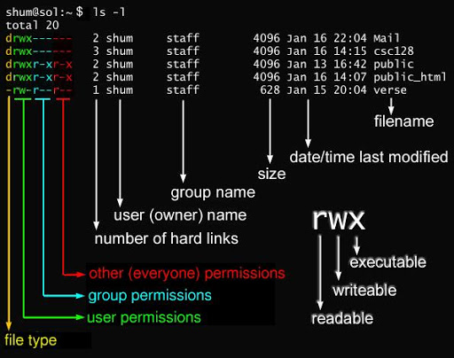

# linux文件基本属性
 - chown 修改所属用户与组
 - chmod 修改用户的权限
 - 11|1s-1 显示文件的属性和所属用户和组


```bash
[root@www /]# ls -l
total 64
dr-xr-xr-x   2 root root 4096 Dec 14  2012 bin
dr-xr-xr-x   4 root root 4096 Apr 19  2012 boot
```
- d 目录
- -文件
- l 链接文档
- b 装置文件里面的可供储存的接口设备(可随机存取装置)
- c 装置文件里面的串行端口设备，例如键盘、鼠标(一次性读取装置)
- r 可读
- w 可写
- x 执行

>这三个权限的位置不会改变，如果没有权限，就会出现减号 - 而已。


- 第 1-3 位确定属主（该文件的所有者）拥有该文件的权限
- 第4-6位确定属组（所有者的同组用户）拥有该文件的权限
- 第7-9位确定其他用户拥有该文件的权限
- *第 1、4、7 位读权限， r ，则有读权限， - 字符，则没有读权限*
- *第 2、5、8 位写权限， w ，则有写权限， - 字符, 没有写权限*
- *第 3、6、9 位可执行权限， x ，则有执行权限，- 字符，则没有执行权限。*
***
# ***Linux文件属主和属组***
```bash
[root@www /]# ls -l
total 64
drwxr-xr-x 2 root  root  4096 Feb 15 14:46 cron
drwxr-xr-x 3 mysql mysql 4096 Apr 21  2014 mysql
……
```
